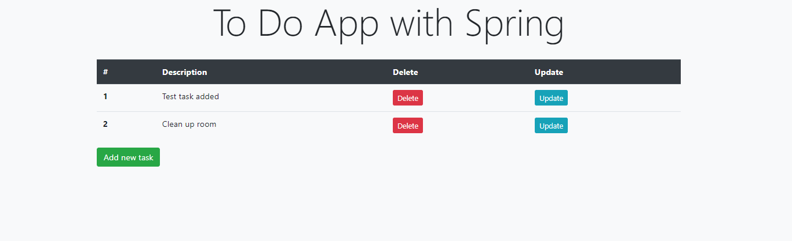
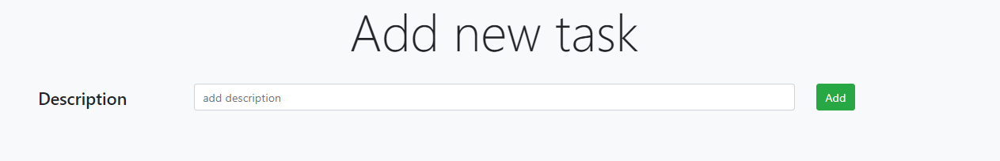

# ToDoApp-Spring
## Table of contents
* [General info](#general-info)
* [Technologies](#technologies)
* [Setup](#setup)
* [Author](#author)
* [Screenshots](#screenshots)

## General info
**This project is a simple To Do App created with Spring**

## Technologies
Project is created with:
* Java version 11.0
* Spring Boot version 2.3.1
* H2 Database version 1.4.200
* Thymeleaf version 3.0.11
* JUnit 5

## Setup
To open and run this project, follow this commands:
1. git clone https://github.com/wlazlok/ToDoApp-Spring.git
2. cd .\ToDoApp-Spring\
3. mvn spring-boot:run

Then you can open app in browser on port **8081** *(http://localhost:8081/)*

## Author
* **[Karol Wlazło](https://github.com/wlazlok)**
* **email:** kwlazo9@gmail.com

## Screenshots

